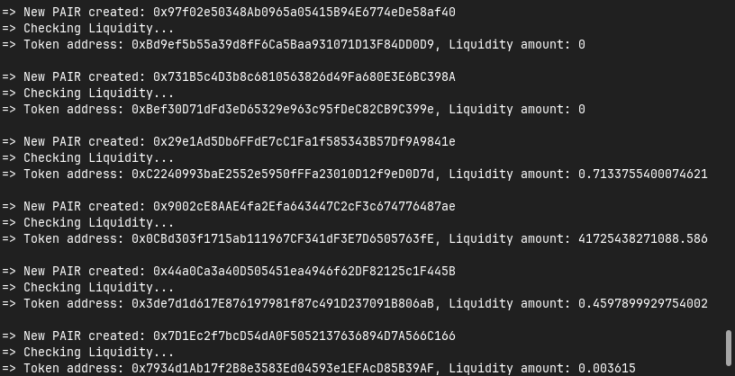

# Check Pair With Liquidity

This project aims to give real-time update of a pair creation on UniSwapV2 Pool and the tokens liquidity.

The script requires `RPC_PROVIDER` in environment variables which is a JSON-RPC websocket url for ethereum node.
If not specified, it will default to a infura websocket.

**Screenshots:**

---

**_Made with ❤️ from [Bangladesh](https://www.google.com/search?q=bangladesh) by [Rakibul Yeasin](https://fb.me/dreygur)_**
